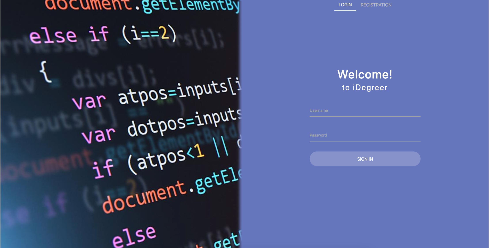
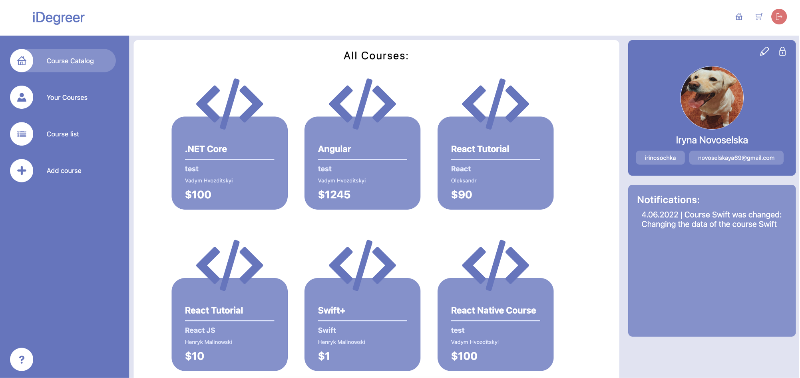
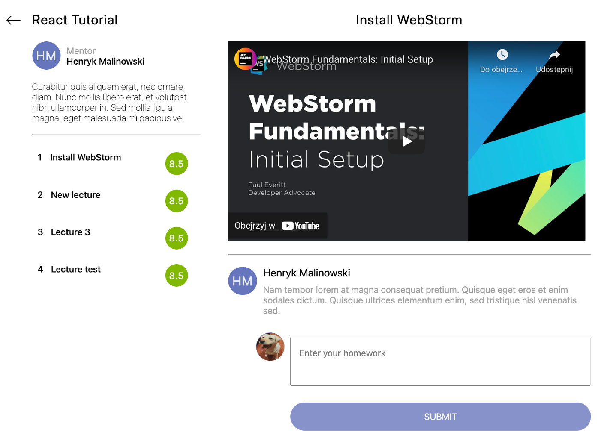
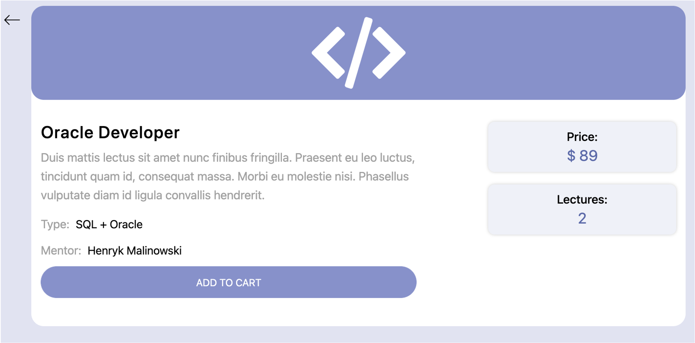
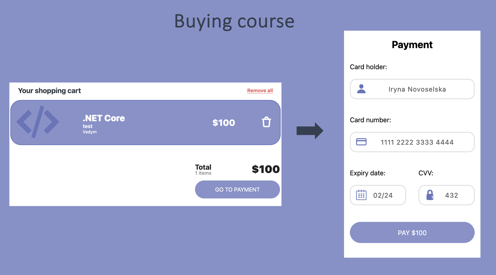
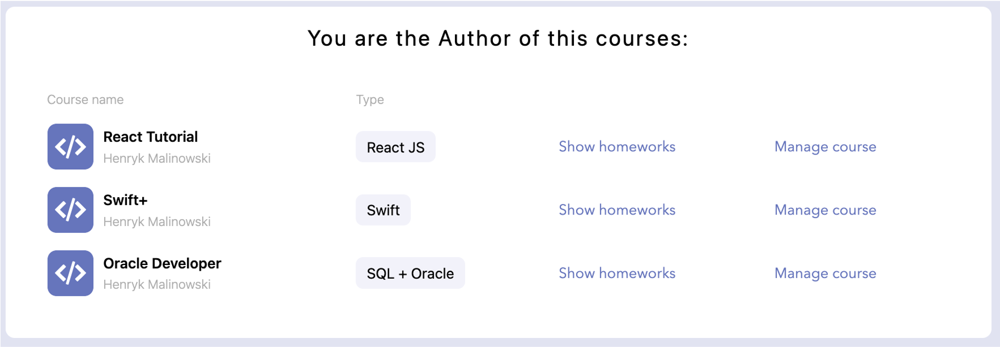

# iDegreer

The main goal of the project was to design and develop a online courses platform, which allows users to add and manage their own courses from the instructor's level and join selected courses from the student's level.

## Screenshots

#### Login 

#### Main 

#### Instruction

## Installation

#### Clone repo

git clone https://github.com/vadimhv/idegreer.git

#### Start aplikacji
W pierwszym terminalu otworzyć foldzer ServerApp  - npm run dev (start backend'u)  
W drugim terminalu otworzyć folder ClientApp - npm start (start front-end'u)

#### Domyślne dostępy
Rola studenta: username: student | password: student1234  
Rola admina: username: admin | password: admin1234  
Rola prowadzącego: username: professor | password: professor1234  

#### API Docs
https://app.swaggerhub.com/apis/idegreer/idegreer/1#/
